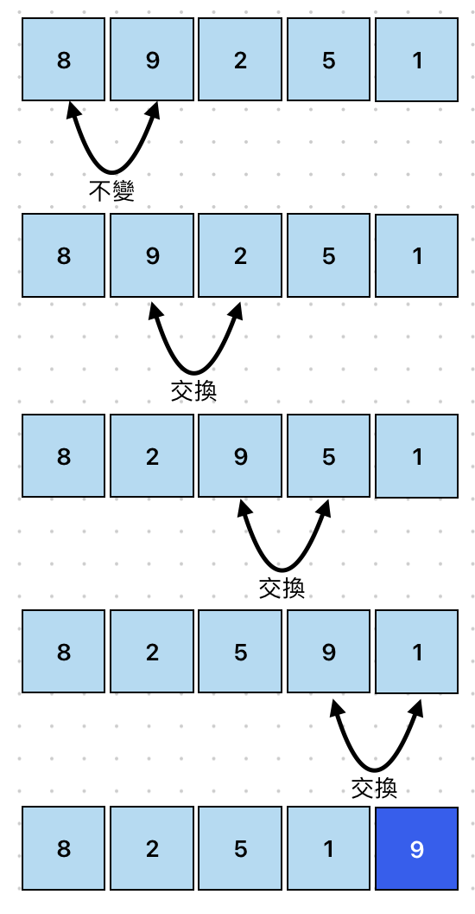
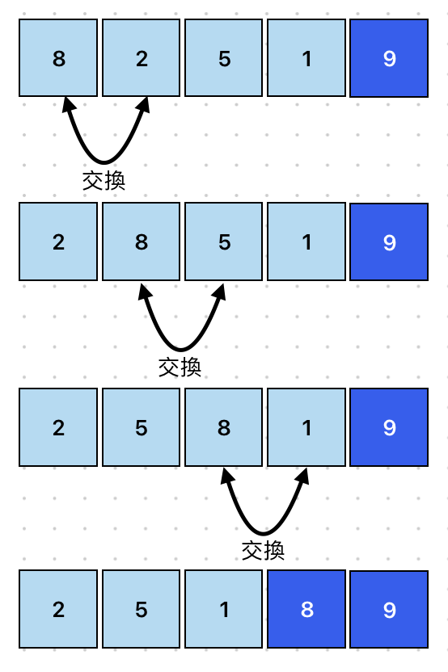
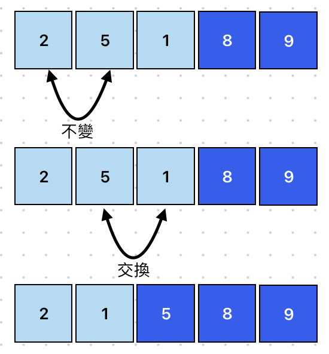
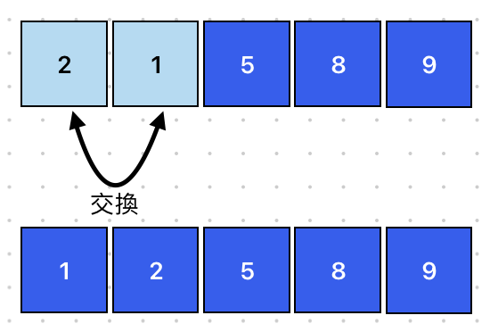

# Bubble Sort 氣泡排序(冒泡排序)
> 平均時間複雜度為: O(n²)

氣泡排序(冒泡排序)又稱交換排序，原理是從第一筆資料開始，逐一比較相鄰兩筆資料，如果兩筆大小順序有誤則做交換，反之則不動，接者再進行下一筆資料比較，所有資料比較完第1回合後，可以確保最後一筆資料是正確的位置。

> [gif來源](https://commons.wikimedia.org/wiki/File:Bubble-sort-example-300px.gif)

## 適用場景
- 適合小型資料集或教學用來理解排序原理
- 不適合大型資料集


## 執行步驟
### 第一回合：逐一比較相鄰兩筆資料

### 第二回合：逐一比較相鄰兩筆資料

### 第三回合：逐一比較相鄰兩筆資料

### 第四回合：逐一比較相鄰兩筆資料


## 範例
```javascript showLineNumbers
// 冒泡排序
function bubbleSort(array) {
  let length = array.length;

  // 負責控制回合數
  for (let i = 0; i < length - 1; i++) {
    // 負責比較並交換資料
    for (let j = 0; j < length - i - 1; j++) {
      // 如果前一個比後一個大，就交換位置
      if (array[j] > array[j + 1]) {
        swap(array, j, j + 1);
      }
    }
  }
  return array;
}

// 交換位置
function swap(array, firstIndex, secondIndex) {
  // 先暫存第一個位置，防止後面被替換時消失
  let temp = array[firstIndex];
  // 第一個位置被第二個位置取代
  array[firstIndex] = array[secondIndex];
  // 第二個位置被暫存的第一個位置取代
  array[secondIndex] = temp;
}

console.log(bubbleSort([8, 9, 2, 5, 1])); // [ 1, 2, 5, 8, 9 ]
```

## 拆解範例
### bubbleSort 氣泡排序(冒泡排序)
```javascript showLineNumbers
// 冒泡排序
function bubbleSort(array) {
  let length = array.length;

  // 負責控制回合數
  for (let i = 0; i < length - 1; i++) {
    // 負責比較並交換資料
    for (let j = 0; j < length - i - 1; j++) {
      // 如果前一個比後一個大，就交換位置
      if (array[j] > array[j + 1]) {
        swap(array, j, j + 1);
      }
    }
  }
  return array;
}
```
- 外層 `for` 迴圈：負責控制回合數
- 內層 `for` 迴圈：負責比較並且交換資料

### swap 負責交換位置
```javascript showLineNumbers
function swap(array, firstIndex, secondIndex) {
  // 1. 先暫存第一個位置，防止後面被替換時消失
  let temp = array[firstIndex];
  // 2. 第一個位置被第二個位置取代
  array[firstIndex] = array[secondIndex];
  // 3. 第二個位置被暫存的第一個位置取代
  array[secondIndex] = temp;
}
```
1. 暫存第一個位置，防止後面替換資料時消失。如：`temp = 2`
2. 將第二個位置的資料賦予給第一個位置。如：`[2, 1] → [1, 1]`
3. 將剛剛暫存的第一個位置的資料賦予給第二個位置。如：`[1, temp] → [1, 2]`

> [【Day21】[演算法]-排序Sort & 氣泡排序法Bubble Sort](https://ithelp.ithome.com.tw/articles/10276184)