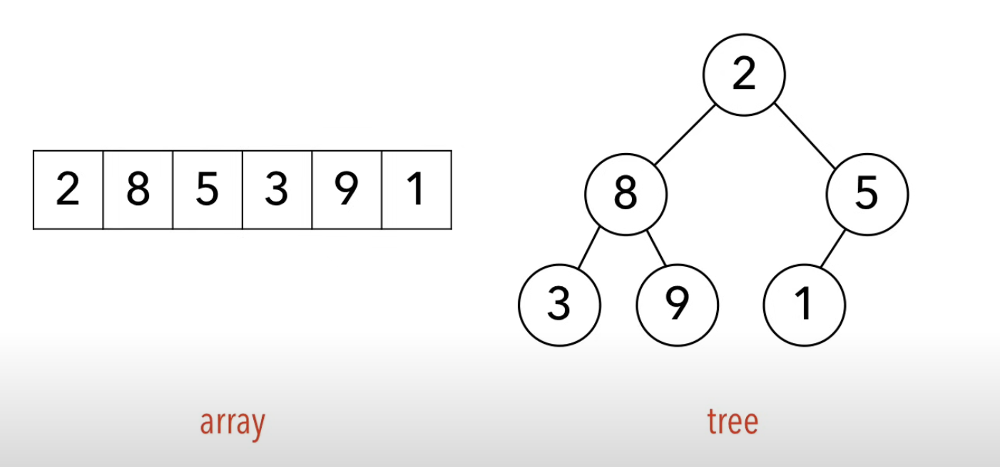
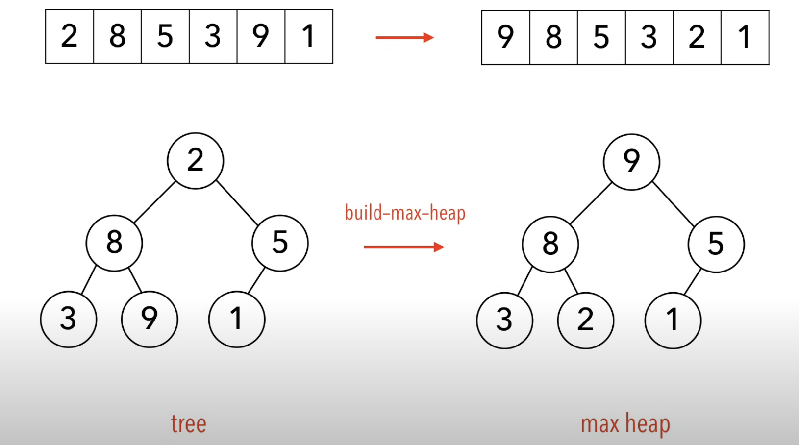
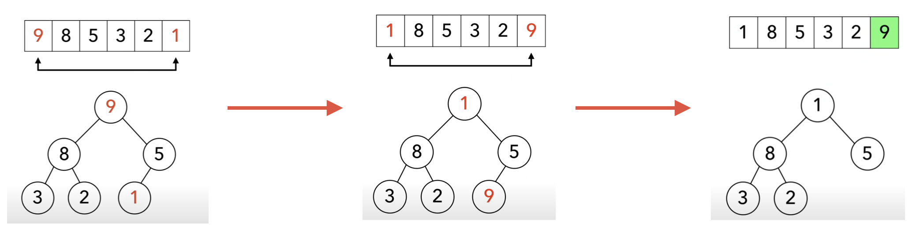
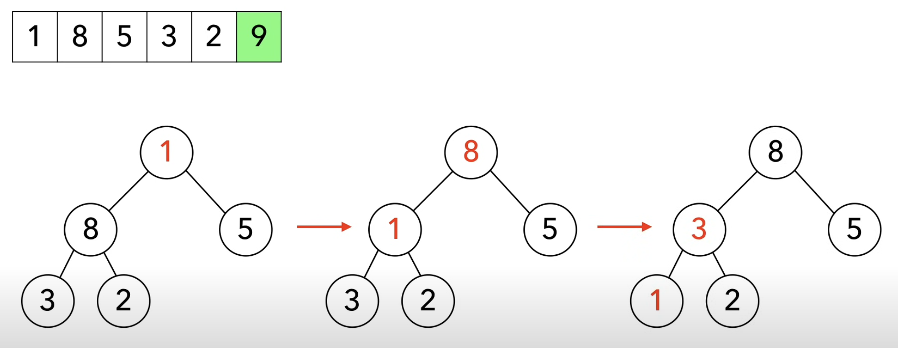

# Heap Sort 堆積排序
使用「完整二元樹（complete binary tree）」這種資料結構，可能為「最大堆積（max heap）」或「最小堆積（min heap）」，使資料依照目標順序由根至葉排列，再將根與最末端節點的值對調，以便一一取出目標資料值進行排序。

- 最大堆積（max heap）：對於每個「子樹」而言，「根」的資料必為最大；資料值大小由根至葉遞減。
- 最小堆積（min heap）：對於每個「子樹」而言，「根」的資料必為最小；資料值大小由根至葉遞增。

## 適用場景
- 需要穩定的 O(n log n) 性能（比 Quick Sort 穩定，避免最壞 O(n²)）。
- 優先隊列（Priority Queue）（例如：任務調度、遊戲 AI）。
- 大數據排序（適合資料量較大但不要求穩定性的應用）。
- 外部排序（External Sorting）（當資料大到無法一次放入記憶體時）。

## 執行步驟

1. 首先有一個未排列得陣列，將他組成一個 Tree。
排列方式為：
`2 → index 0 → 根部`
`8 → index 1 → 根部 > 左邊子根部`
`5 → index 2 → 根部 > 右邊子根部`
`3 → index 3 → 根部 > 左邊子根部 > 左邊子項目`
`9 → index 4 → 根部 > 左邊子根部 > 右邊子項目`
`1 → index 5 → 根部 > 右邊子根部 > 左邊子項目`

但這樣並不是一個「最大堆積」或「最小堆積」，所以我們要將它重新排列。
> 這裡的範例都用最大堆積來講解


2. 將 Tree 重新排列至最大值都在最上面
- 尋找最大值是誰？ 
    - `9` 是裡面中最大的，發現到他被放在底部，將他移至最上層
- 檢查其餘有沒有大的數字被放在底部，沒有結束排列


3. 將 `9 → index 0` 移至最後面 `index 5`
- 已知目前 `index 5 為 1`，將 `9` 和 `1` 互換
- 固定 `9` 刪除 Tree 中的 `9`
- 此時又發現根部不是最大值，再次重新排列


4. 再次將 Tree 重新排列至最大值都在最上面，接著一直重複「2、3」步驟，就可以得到正確的排列順序了。

## 範例
```javascript=
function heapSort(arr) {
  const result = []; // 儲存最終排序結果
  // 重複取出最大值，直到陣列空了
  while (arr.length > 0) {
    // 建立最大堆
    buildMaxHeap(arr);
    // 取出最大值放到結果中
    const max = arr[0];
    const min = arr[arr.length - 1];
    result.unshift(max);
    // 將堆的最後一個值補到堆頂
    arr[0] = min;
    // 刪除最後一個元素（縮小堆範圍）
    arr.pop();
  }
  return result;
}

// 最大堆建立（重複讓陣列成為堆）
function buildMaxHeap(arr) {
  const lastLeafIndex = Math.floor(arr.length / 2) - 1;
  for (let i = lastLeafIndex; i >= 0; i--) {
    heapify(arr, arr.length, i);
  }
}

// 堆化：確保某節點以下是最大堆
function heapify(arr, heapSize, rootIndex) {
  let largestIndex = rootIndex;
  const leftChildIndex = 2 * rootIndex + 1;
  const rightChildIndex = 2 * rootIndex + 2;

  const leftNode = arr[leftChildIndex];
  const rightNode = arr[rightChildIndex];

  // 比較左右子節點，找最大值
  if (leftChildIndex < heapSize && leftNode > arr[largestIndex]) {
    largestIndex = leftChildIndex;
  }
  if (rightChildIndex < heapSize && rightNode > arr[largestIndex]) {
    largestIndex = rightChildIndex;
  }

  // 如果最大值不是根節點，交換，並遞迴調整子樹
  if (largestIndex !== rootIndex) {
    // 先暫存 rootNode，防止後面被替換時消失
    const rootNode = arr[rootIndex];
    arr[rootIndex] = arr[largestIndex];
    arr[largestIndex] = rootNode;
    heapify(arr, heapSize, largestIndex);
  }
}

console.log(heapSort([2, 8, 5, 3, 9, 1]));
```

## 拆解範例
### heap sort
```javascript=
function heapSort(arr) {
  const result = []; // 儲存最終排序結果
  // 重複取出最大值，直到陣列空了
  while (arr.length > 0) {
    // 建立最大堆
    buildMaxHeap(arr);
    const max = arr[0];
    const min = arr[arr.length - 1];

    // 取出最大值放到結果中
    result.unshift(max);
    // 將堆的最後一個值補到堆頂
    arr[0] = min;
    // 刪除最後一個元素（縮小堆範圍）
    arr.pop();
  }
  return result;
}
```
### buildMaxHeap 建立最大堆積(最大堆積的陣列)
用來將整個陣列轉換成一個**最大堆積**，確保整個堆的結構滿足**每個根節點都大於其子節點**的規則
- 範圍：處理的是整個陣列，不只是單一子樹。
- 目標：將整個陣列轉換為最大堆積（根節點最大）。
- 操作：
    1. 從最後一個「非葉節點」開始（因為葉節點已經天然滿足堆規則）。
    2. 一路向上，對每個節點執行 heapify，確保每個節點及其子樹都滿足堆的規則。
    3. 重複操作直到根節點，完成整個陣列的堆化。
<!-- - 把整個陣列轉換成一個「最大堆積」(滿足根節點比子節點大的結構)。
- 從最後一個非葉節點開始，一路向上對每個節點進行 heapify，直到整個陣列都符合最大堆積規則。 -->
```javascript=
// 最大堆建立（重複讓陣列成為堆）
function buildMaxHeap(arr) {
  const lastLeafIndex = Math.floor(arr.length / 2) - 1;
  for (let i = lastLeafIndex; i >= 0; i--) {
    heapify(arr, arr.length, i);
  }
}
```
:::warning
#### 為什麼從 `Math.floor(arr.length / 2) - 1` 開始？
因為陣列的一半之後都是葉節點，葉節點本身不需要堆化(因為沒有子節點可以比較)！
我們只需要從最後一個「非葉節點」開始處理，這樣可以節省運算！
:::

### heapify 建立以某個節點為根的子堆積(包含它的子節點)
用來調整某個節點及其子樹，確保以該節點為根的子樹符合**最大堆積**的特性
- 範圍：處理的不是單一節點，而是「以某個節點為根的一整個子樹」。
- 目標：確保該節點（根節點）及其子樹滿足最大堆的規則。
- 操作：
    1. 比較根節點與左右子節點的值。
    2. 如果發現某個子節點的值大於根節點，則交換位置。
    3. 遞迴向下堆化該子節點，直到整個子樹都符合最大堆的特性。
> 通常都會命名為 heapify
```javascript=
// 堆化：確保某節點以下是最大堆
function heapify(arr, heapSize, rootIndex) {
  let largestIndex = rootIndex;
  const leftChildIndex = 2 * rootIndex + 1;
  const rightChildIndex = 2 * rootIndex + 2;

  const leftNode = arr[leftChildIndex];
  const rightNode = arr[rightChildIndex];

  // 比較左右子節點，找最大值
  if (leftChildIndex < heapSize && leftNode > arr[largestIndex]) {
    largestIndex = leftChildIndex;
  }
  if (rightChildIndex < heapSize && rightNode > arr[largestIndex]) {
    largestIndex = rightChildIndex;
  }

  // 如果最大值不是根節點，交換，並遞迴調整子樹
  if (largestIndex !== rootIndex) {
    // 先暫存 rootNode，防止後面被替換時消失
    const rootNode = arr[rootIndex];
    arr[rootIndex] = arr[largestIndex];
    arr[largestIndex] = rootNode;
    heapify(arr, heapSize, largestIndex);
  }
}
```


> 參考、圖片來源：
> [Youtube - Heap sort in 4 minutes](https://youtu.be/2DmK_H7IdTo?si=iJ3uDX_svwkuu1Xt)
> [演算法學習筆記：堆積排序（Heap Sort）](https://medium.com/@ralph-tech/%E6%BC%94%E7%AE%97%E6%B3%95%E5%AD%B8%E7%BF%92%E7%AD%86%E8%A8%98-%E5%A0%86%E7%A9%8D%E6%8E%92%E5%BA%8F-heap-sort-4a4f6d48482e)
> [堆積排序法(Heap Sort)筆記](https://ithelp.ithome.com.tw/articles/10253199)