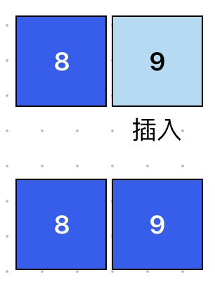

# Insertion Sort 插入排序
> 平均時間複雜度為: O(n²)

逐一將數字插入到已排序的部分，確保左側部分始終有序。

## 適用場景
- 小型數據集（少於 1000 筆）（簡單且直覺）。
- 幾乎排序好的陣列（Nearly Sorted Array）（時間接近 O(n)，比其他 O(n²) 演算法更快）。
- 需要穩定排序的情境。
- 記憶體有限的環境。
## 執行步驟
### 第一回合：從未排列資料中取出一個資料，插入到已排好資料中正確位置
已排好資料目前為空，所以將新資料放入

### 第二回合：從未排列資料中取出一個資料，插入到已排好資料中正確位置
已排好資料已有資料，去檢查已排好資料，並且插入到正確位置

### 第三回合：從未排列資料中取出一個資料，插入到已排好資料中正確位置
已排好資料已有資料，去檢查已排好資料，並且插入到正確位置

### 第四回合：從未排列資料中取出一個資料，插入到已排好資料中正確位置
已排好資料已有資料，去檢查已排好資料，並且插入到正確位置

### 第五回合：從未排列資料中取出一個資料，插入到已排好資料中正確位置
已排好資料已有資料，去檢查已排好資料，並且插入到正確位置


## 範例
```javascript showLineNumbers
// 插入排序
function insertionSort(array) {
  let length = array.length;
  // 負責控制回合數
  for (let i = 0; i < length - 1; i++) {
    // 巡迴已排序部分
    for (let j = i + 1; j > 0; j--) {
      if (array[j - 1] > array[j]) {
        swap(array, j - 1, j);
      }
    }
  }
  return array;
}

// 交換位置
function swap(array, firstIndex, secondIndex) {
  // 先暫存第一個位置，防止後面被替換時消失
  let tempValue = array[firstIndex];
  // 第一個位置被第二個位置取代
  array[firstIndex] = array[secondIndex];
  // 第二個位置被暫存的第一個位置取代
  array[secondIndex] = tempValue;
}

console.log(insertionSort([8, 9, 2, 5, 1])); // [ 1, 2, 5, 8, 9 ]
```
## 拆解範例
### insertionSort 插入排序
```javascript showLineNumbers
function insertionSort(array) {
  let length = array.length;
  // 負責控制回合數
  for (let i = 0; i < length - 1; i++) {
    // 巡迴已排序部分
    for (let j = i + 1; j > 0; j--) {
      if (array[j - 1] > array[j]) {
        swap(array, j - 1, j);
      }
    }
  }
  return array;
}
```
- 外層 `for` 迴圈：負責控制回合數
- 內層 `for` 迴圈：巡迴已經排序的資料，並負責比較交換資料
    - 將`目前拿到的資料（外層迴圈的資料）`**插入**在`已經排好的資料（內層迴圈的資料）`中正確的位置

### swap 負責交換位置
```javascript showLineNumbers
function swap(array, firstIndex, secondIndex) {
  // 1. 先暫存第一個位置，防止後面被替換時消失
  let temp = array[firstIndex];
  // 2. 第一個位置被第二個位置取代
  array[firstIndex] = array[secondIndex];
  // 3. 第二個位置被暫存的第一個位置取代
  array[secondIndex] = temp;
}
```
1. 暫存第一個位置，防止後面替換資料時消失。如：`temp = 2`
2. 將第二個位置的資料賦予給第一個位置。如：`[2, 1] → [1, 1]`
3. 將剛剛暫存的第一個位置的資料賦予給第二個位置。如：`[1, temp] → [1, 2]`

> [【Day23】[演算法]-插入排序法Insertion Sort](https://ithelp.ithome.com.tw/articles/10277360)