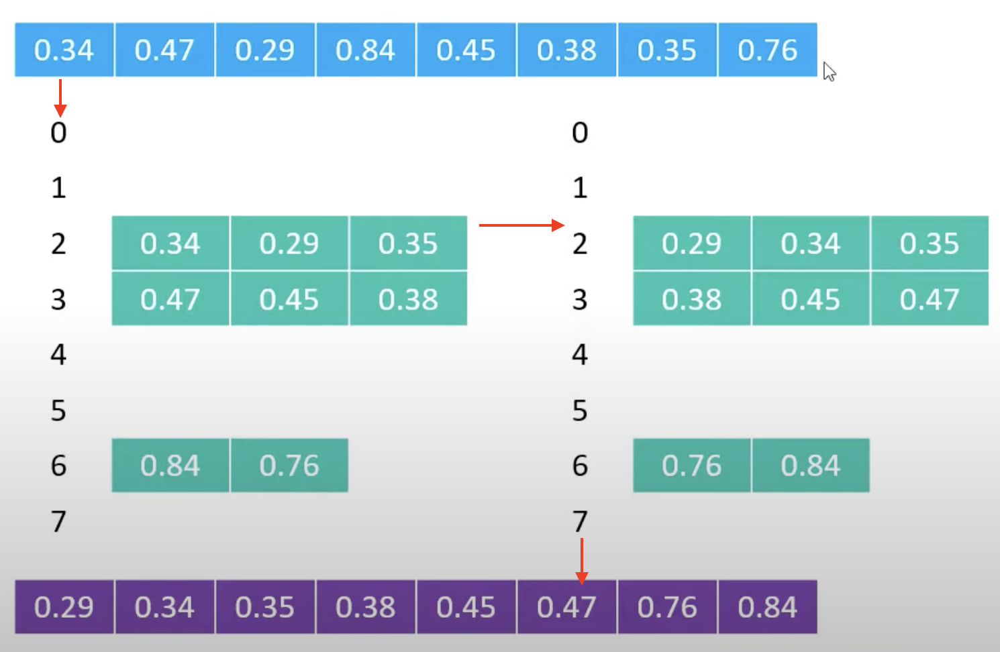
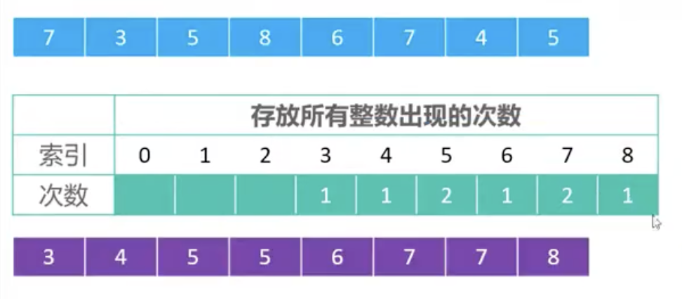
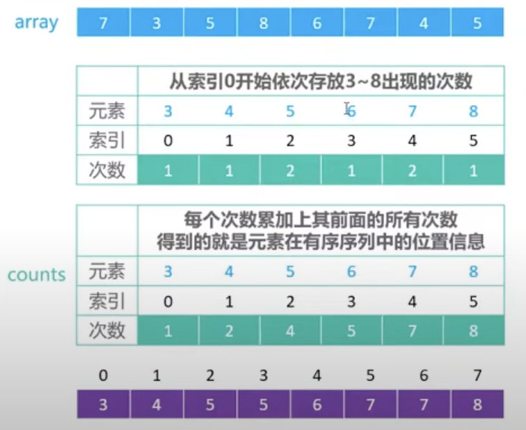
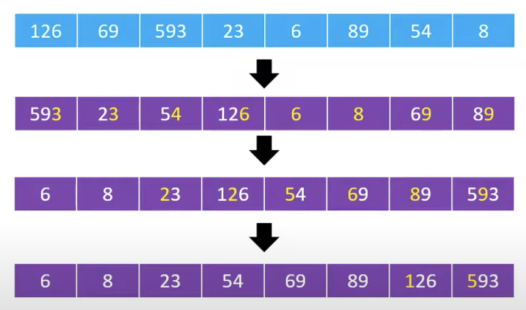

# 線性排序法 - Bucket Sort & Counting Sort & Radix Sort
:::info
線性排序法是一種排序方法，通常指的是時間複雜度為 `O(n)` 的排序算法，而之所以能達到線性排序法，是因為這種排序是『**非基於比較的**』，但它的適用場景也會有很大的限制。
:::

線性排序法有三種：
- 桶排序 Bucket Sort
- 計數排序 Counting Sort
- 基數排序 Radix Sort

| 排序算法  | 時間複雜度    | 空間複雜度 |
| -------- | --------    | -------- |
| 桶排序    | O(n + k)    | O(n + k) |
| 計數排序	 | O(n + k)   | O(n + k) |
| 基數排序	 | O(k ＊ n)  | O(n)      |

如何選擇：
- 如果數據範圍已知且分佈均勻，選擇『桶排序』。
- 如果數據範圍有限，選擇『計數排序』。
- 如果數據為整數或浮點數，位數固定且分佈較寬，選擇『基數排序』。

## 桶排序（Bucket Sort）
:::info
桶排序是將數據分到若干個桶中，然後對每個桶中的元素進行排序，最後將所有桶中的元素按順序放回原來的數列中。

這種排序方法通常需要與其他排序算法（如計數排序或快速排序）配合使用。
:::

時間複雜度：O(n + k)，其中 n 是數列長度，k 是桶的數量。


### 適用情境
- 適合數據分佈均勻的情況，例如浮點數在 `[0, 1)` 範圍內。
舉例：`100個元素 - [0, 1) * 100 = [0, 100) = [0, 99]`
    :::spoiler 關於左閉右開意思 `[a, b)`
    左閉右開區間：`[a, b)`
    - 包含左端點 a，但不包含右端點 b。
    - 數據屬於該區間的條件是：a ≤ x < b。
    :::
- 適用於數據範圍已知且可以平均分配到桶中的情況。

### 執行步驟
1. 先定義一個規則將他們分類 (上圖範例是：`值 ＊ 值的總數量 = 索引值(取整數)`)至桶中
2. 將每一個桶中數值依序排序
3. 將所有桶合併

```javascript showLineNumbers
// 桶排序實現 (JavaScript 版本)

function bucketSort(arr) {
    // 1. 建立桶並將元素分類
    const n = arr.length;
    const buckets = Array.from({ length: n }, () => []);

    // 將每個元素放入對應的桶中
    for (let i = 0; i < n; i++) {
        const index = Math.floor(arr[i] * n); // 根據值 * 長度決定桶的索引
        buckets[index].push(arr[i]);
    }

    // 2. 對每個桶中的元素進行排序
    for (let i = 0; i < n; i++) {
        buckets[i].sort((a, b) => a - b); // 升序排序
    }

    // 3. 合併所有桶的元素
    return buckets.flat();
}

const arr = [0.34, 0.47, 0.29, 0.84, 0.45, 0.38, 0.35, 0.76];
const sortedArr = bucketSort(arr);
console.log(sortedArr); // 輸出排序結果

```

### 優點
- 高效：當數據分佈均勻且每個桶中的數據數量適中時，時間複雜度接近 O(n)。
- 靈活：可以與其他排序方法（如快速排序）結合使用來對每個桶內進行排序。

### 缺點
- 依賴分佈：如果數據分佈不均，某些桶可能包含大量數據，導致效率下降。
- 空間消耗：需要額外的桶來存儲數據，空間需求較高。
- 實現複雜：桶數量和分配方式需要根據數據特徵設計。

## 計數排序（Counting Sort）
:::info
計數排序是一種非比較排序的算法，適用於數值範圍已知且比較小的情況。
:::
時間複雜度：O(n + k)，其中 n 是數組的大小，k 是數列中的最大值。


### 適用情境
- 適合用於**整數**的數據
- 數據範圍較小
- 資料重複頻繁，且不需要維護數據的相對順序

### 執行步驟
#### 基本執行步驟：
1. 取出最大值 & 最小值
2. 將每個數字出現的次數放到對應的索引`(也就是數字本人)`
3. 排序：每個索引`(也就是數字本人)`出現幾次就寫幾次
```javascript showLineNumbers
function countingSort(arr) {
  const max = Math.max(...arr);
  const min = Math.min(...arr);
  const count = Array(max - min + 1).fill(0);
  const result = [];

  arr.forEach((i) => {
    count[i - min]++;
  });

  count.forEach((count, idx) => {
    while (count > 0) {
      result.push(idx + min);
      count--;
    }
  });

  return result;
}

console.log(countingSort([5, 3, 2, 8, 5, 8, 9, 3, 1, 4, 6, 7]));
// [1, 2, 3, 3, 4, 5, 5, 6, 7, 8, 8, 9]
```
#### 改進後的執行步驟：（也可以使用負數）
1. 取出最大值 & 最小值
2. 計算偏移量，將數列轉為非負數列
3. 將每個數字出現的次數放到對應的索引
4. 排序：每個索引（扣除偏移量後）出現幾次就寫幾次
```javascript showLineNumbers
function countingSort(arr) {
  const max = Math.max(...arr);
  const min = Math.min(...arr);
  const offset = -min;

  // 建立計數陣列
  const count = Array(max - min + 1).fill(0);

  // 填充計數陣列
  for (let num of arr) {
    count[num + offset]++;
  }

  // 根據計數陣列重建排序數列
  const result = [];
  for (let i = 0; i < count.length; i++) {
    while (count[i] > 0) {
      result.push(i - offset);
      count[i]--;
    }
  }

  return result;
}

console.log(countingSort([-15, -3, 2, -8, 5, 8, -9, 3, 1, 4, 6, 7]));
// [-15, -9, -8, -3, 1, 2, 3, 4, 5, 6, 7, 8]
```
#### 改進後的執行步驟：（是穩定的）

1. 取出最大值 & 最小值
2. 計算偏移量，將數列轉為非負數列
3. 建立計數陣列，並記錄每個數字出現的次數
4. 累加計數陣列，計算每個數字在排序後的最終位置範圍
5. **從後向前遍歷原數列**，根據計數陣列放置數字，並更新計數陣列
6. 還原結果數列為原始數字範圍
```javascript showLineNumbers
function stableCountingSort(arr) {
  const max = Math.max(...arr);
  const min = Math.min(...arr);
  const offset = -min;

  // 建立計數陣列
  const count = Array(max - min + 1).fill(0);

  // 填充計數陣列（計算每個數字出現的次數）
  for (let num of arr) {
    count[num + offset]++;
  }

  // 調整計數陣列，計算每個數字的最終位置
  for (let i = 1; i < count.length; i++) {
    count[i] += count[i - 1];
  }

  // 建立排序結果陣列
  const result = [];

  // 從後向前遍歷輸入陣列，根據計數陣列的位置放置數字
  for (let i = arr.length - 1; i >= 0; i--) {
    const num = arr[i];
    const position = count[num + offset] - 1; // 計算該數字的最後位置
    result[position] = num; // 放入排序陣列
    count[num + offset]--;  // 更新該數字的位置索引
  }

  return result;
}

console.log(stableCountingSort([5, 3, 2, 5, 8, 9, 3, 1, 6, 7]));
// [1, 2, 3, 3, 5, 5, 6, 7, 8, 9]
console.log(stableCountingSort([4, -2, -2, 0, 4, -1, 3]));
// [-2, -2, -1, 0, 3, 4, 4]
```
```javascript showLineNumbers
補充解析：調整計數陣列，計算每個數字的最終位置
// 以此範例為例：const arr = [4, -2, -2, 0, 4, -1, 3];
// 填充後 count 為 [2, 1, 1, 0, 0, 1, 2]
// 經過下方調整後 count 為 [2, 3, 4, 4, 4, 5, 7]
索引：每個數字出現的次數＋前面有幾個位置被佔走
    1 : 1 + 2 = 3
    2 : 1 + 3 = 4
    3 : 0 + 4 = 4
    4 : 0 + 4 = 4
    5 : 1 + 4 = 5
    6 : 2 + 5 = 7
for (let i = 1; i < count.length; i++) {
    count[i] += count[i - 1];
}
```
```javascript showLineNumbers
補充解析：從後向前遍歷輸入陣列，根據計數陣列的位置放置數字
// 以此範例為例：const arr = [4, -2, -2, 0, 4, -1, 3];
// count 為 [2, 3, 4, 4, 4, 5, 7]
i: 6 num: 3  position: 4 result: [ <4 empty items>, 3, <2 empty items> ]
i: 5 num: -1 position: 2 result: [ <2 empty items>, -1, <1 empty item>, 3, <2 empty items> ]
i: 4 num: 4  position: 6 result: [ <2 empty items>, -1, <1 empty item>, 3, <1 empty item>, 4 ]
i: 3 num: 0  position: 3 result: [ <2 empty items>, -1, 0, 3, <1 empty item>, 4 ]
i: 2 num: -2 position: 1 result: [ <1 empty item>, -2, -1, 0, 3, <1 empty item>, 4 ]
i: 1 num: -2 position: 0 result: [ -2, -2, -1, 0, 3, <1 empty item>, 4 ]
i: 0 num: 4  position: 5 result: [ -2, -2, -1, 0, 3,  4,  4 ]
for (let i = arr.length - 1; i >= 0; i--) {
    const num = arr[i];
    const position = count[num + offset] - 1; // 計算該數字的最後位置
    result[position] = num; // 放入排序陣列
    count[num + offset]--;  // 更新該數字的位置索引
}
```
### 優點
- 高效：當數據範圍有限時，能達到 O(n + k) 的時間複雜度
- 簡單：邏輯清晰，容易實現
- 穩定：改進後可以保證排序穩定性
- 可以負數：改進後可以負數，原始實現中不支持負數

### 缺點
- 空間消耗大：如果數據範圍很大，需要建立一個大尺寸的計數陣列
- 範圍限制：只適用於範圍已知且範圍小的數據

## 基數排序（Radix Sort）
:::info
基數排序將數據按照每個數字的位數進行排序。

執行流程：依次對個位數、十位數、百位數、千位數...進行排序`（只能從低到高，不能從高到低）`。
:::
時間複雜度：O(nk)，其中 n 是數列長度，k 是數字的位數。


### 適用情境
- 適合用於數字資料（整數或小數）。
- 適用於範圍廣、長度固定的數據。
- 適用於需要排序的數據範圍較大，但位數（數字長度）較小的情況。

### 執行步驟
1. 取出陣列中最大的數字 ＆ 最大數字的位數
2. 進行基數排序
3. 重複步驟 2 直到排序完成
```javascript showLineNumbers
function radixSort(arr) {
  const max = Math.max(...arr); // 取出最大值
  const maxDigits = String(max).length; // 取出最大位數

  let divisor = 1; // 初始除數 (個位數開始)

  for (let d = 0; d < maxDigits; d++) {
    arr = countingSortByDigit(arr, divisor);
    divisor *= 10; // 移動到下一位數
  }

  return arr;
}

function countingSortByDigit(arr, divisor) {
  const count = Array(10).fill(0); // 每位數可能是 0-9，共 10 個
  const result = Array(arr.length);

  // 計數：基於 (數字 / 除數) % 10 計算該位數
  for (const num of arr) {
    const digit = Math.floor(num / divisor) % 10;
    count[digit]++;
  }

  // 調整計數陣列，計算每個數字的最終位置
  for (let i = 1; i < count.length; i++) {
    count[i] += count[i - 1];
  }

  // 倒序遍歷，按該位數的排序結果構造穩定序列
  for (let i = arr.length - 1; i >= 0; i--) {
    const num = arr[i];
    const digit = Math.floor(num / divisor) % 10;
    const position = count[digit] - 1;
    result[position] = num; // 放入結果陣列
    count[digit]--; // 更新該位數的位置索引
  }

  return result;
}

console.log(radixSort([170, 45, 75, 90, 802, 24, 2, 66]));
// [2, 24, 45, 66, 75, 90, 170, 802]
```

### 優點
- 穩定性高：基數排序的穩定性依賴於內部使用的穩定排序（如計數排序）。
- 效率高：在位數固定且範圍較小的情況下，比比較排序快。
- 不涉及比較：不需要像快速排序那樣進行多次比較。

### 缺點
- 依賴位數：數據的位數越多，排序次數越多，效率會下降。
- 空間消耗：需要額外的桶或計數陣列來輔助排序。
- 非通用：不適用於非數字類型的資料。

> 參考文章：
> [三種線性排序算法 計數排序、桶排序與基數排序](https://byvoid.com/zht/blog/sort-radix/)
> [Youtube - 05计数、基数、桶排序](https://www.youtube.com/watch?v=eCvX9zcolzc)
> [Youtube - Counting Sort](https://youtu.be/EItdcGhSLf4?si=Wy78F5II-l3hN2RA)