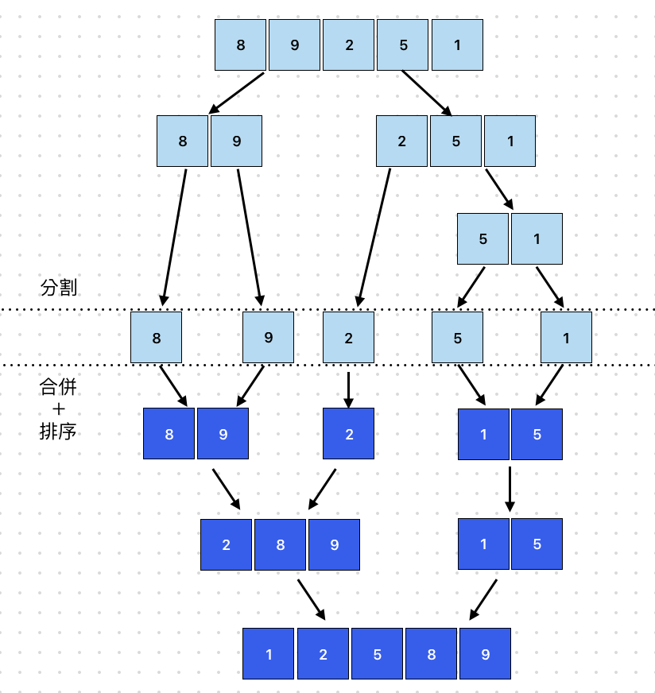

# Merge Sort 合併排序
> 平均時間複雜度為: O(n log n)

合併排序的原理是會先將原始資料分割成兩個資料列，接著再將兩個資料繼續分割成兩個資料列，依此類推，直到無法再分割。
當每組都只剩下一筆資料時，再兩兩合併各組資料，合併時也會進行該組排序，每次排序都是比較最左邊的資料，將較小的資料加到新的資料列中，依此類推，直到最後合併成一個排序好的資料列為止。
## 適用場景
- 大規模數據集（百萬級別）（O(n log n) 表現穩定）。
- 需要穩定排序的應用。
- 鏈結串列（Linked List）排序（不像 Quick Sort 需要隨機存取）。
- 外部排序（External Sorting）（適合無法一次載入記憶體的大型資料，如磁碟排序）。

## 執行步驟

1. 先將資料分割成兩個資料，以此類推直到無法分割
2. 最後將資料一邊排序一邊合併

## 範例
```javascript showLineNumbers
function mergeSort(array) {
  const length = array.length;
  if (length <= 1) return array;
  let middleIndex = Math.floor(length / 2);
  let leftArray = array.slice(0, middleIndex);
  let rightArray = array.slice(middleIndex);
  return merge(mergeSort(leftArray), mergeSort(rightArray));
}

function merge(leftArray, rightArray) {
  if (leftArray.length === 0) return rightArray;
  if (rightArray.length === 0) return leftArray;
  let mergeArray = [];
  let leftIndex = 0;
  let rightIndex = 0;
  
  while (leftIndex < leftArray.length && rightIndex < rightArray.length) {
    if (leftArray[leftIndex] < rightArray[rightIndex]) {
      mergeArray.push(leftArray[leftIndex]);
      leftIndex++;
    } else {
      mergeArray.push(rightArray[rightIndex]);
      rightIndex++;
    }
  }
  
  return mergeArray
    .concat(leftArray.slice(leftIndex))
    .concat(rightArray.slice(rightIndex));
}

console.log(mergeSort([8, 9, 2, 5, 1])); // [ 1, 2, 5, 8, 9 ]
```
## 拆解範例
### mergeSort 合併排序
```javascript showLineNumbers
function mergeSort(array) {
  const length = array.length;
  if (length <= 1) return array;
  let middleIndex = Math.floor(length / 2);
  let leftArray = array.slice(0, middleIndex);
  let rightArray = array.slice(middleIndex);
  return merge(mergeSort(leftArray), mergeSort(rightArray));
}
```
1. 處理基礎情況：
    - 若陣列`長度 <= 1`，直接回傳，因為**單個元素或空陣列已經是排序好的**。
2. 拆分陣列：
    - 計算中間索引 `middleIndex` ，將陣列分為『左、右』兩部分。
3. 遞迴排序：
    - 分別對左、右子陣列遞迴執行 `mergeSort`，直到所有子陣列都變成單一元素。
4. 合併排序後的子陣列：
    - 透過 `merge` 函式合併左右已排序的陣列，並回傳最終排序好的陣列。

### merge 負責合併排序兩個陣列
```javascript showLineNumbers
function merge(leftArray, rightArray) {
  if (leftArray.length === 0) return rightArray;
  if (rightArray.length === 0) return leftArray;
  let mergeArray = [];
  let leftIndex = 0;
  let rightIndex = 0;
  /**
   * 條件：
   * while (leftIndex < leftArray.length && rightIndex < rightArray.length)
   * 只要 左、右陣列都還有值（即 leftIndex 和 rightIndex 都在各自陣列的範圍內），才會進入迴圈。
   * 每次迴圈中，必然會有一個索引（leftIndex 或 rightIndex）增加，因為其中一個值會被推入 mergeArray。
   * 退出條件：
   * 左陣列或右陣列的其中之一被完全處理 時，while 迴圈結束
   * 此時，剩餘的元素只會存在於其中一個陣列中，而另一個陣列已經完全處理完畢。
   */
  while (leftIndex < leftArray.length && rightIndex < rightArray.length) {
    if (leftArray[leftIndex] < rightArray[rightIndex]) {
      mergeArray.push(leftArray[leftIndex]);
      leftIndex++;
    } else {
      mergeArray.push(rightArray[rightIndex]);
      rightIndex++;
    }
  }
  /**
   * 在進入 [剩餘的左陣列或右陣列加入結果]，保證以下情況之一成立：
   * 左陣列已經完全處理完（leftIndex === leftArray.length），slice(leftIndex) 返回空陣列，只有右陣列有剩餘元素。
   * 右陣列已經完全處理完（rightIndex === rightArray.length），slice(rightIndex) 返回空陣列，只有左陣列有剩餘元素。
   */
  return mergeArray
    .concat(leftArray.slice(leftIndex))
    .concat(rightArray.slice(rightIndex));
}
```
1. 處理邊界條件：
    - 若左陣列為空，直接回傳右陣列。
    - 若右陣列為空，直接回傳左陣列。
2. 透過 `while` 迴圈合併：
    - 條件：當左右兩陣列仍有未處理的元素時，進行比對與合併。
    - 邏輯：
        - 若左陣列的元素較小，則推入 `mergeArray` ，並移動左索引值 `(leftIndex)`。
        - 若右陣列的元素較小，則推入 `mergeArray` ，並移動右索引值 `(rightIndex)`。
3. 處理剩餘元素：
    - 當 `while` 迴圈結束時，某一個陣列可能還有未處理的元素。
    - 直接將剩餘的元素合併至 `mergeArray` ，確保所有元素都包含在內。
