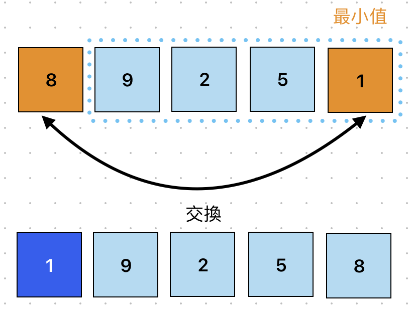
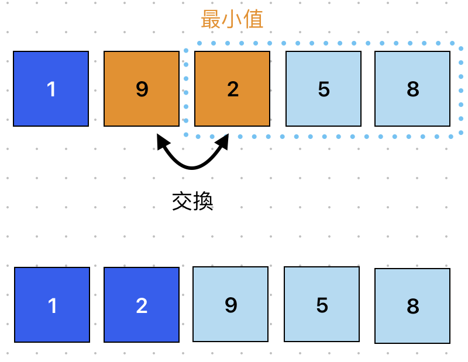
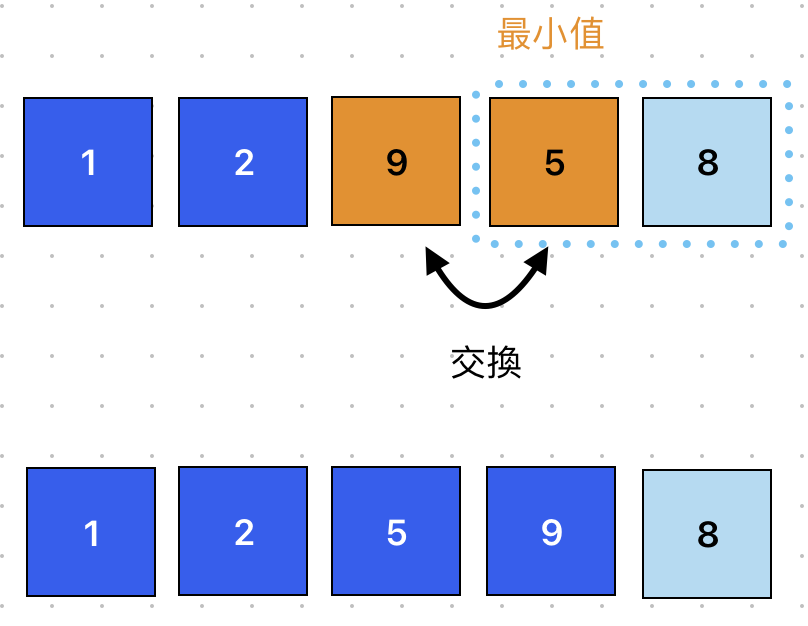
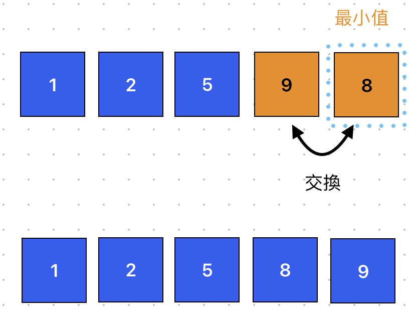

# Selection Sort 選擇排序
> 平均時間複雜度為: O(n²)

反覆從未排序數列中找出最小值，將它與左邊的數做交換。


## 適用場景
- 小型數據集（少於 1000 筆）（簡單易懂，無額外空間需求）。
- 記憶體受限環境（不像 Merge Sort 需要額外空間）。
- 不要求穩定排序（如果可以變更元素相對順序）。
- 當資料寫入次數要最少（交換次數較少，適合 Flash 記憶體）。


## 執行步驟
由小排到大
### 第一回合：`arr[0]` 去比對右邊區塊，找出最小值，然後替換固定位置

### 第二回合：`arr[1]` 去比對右邊區塊，找出最小值，然後替換固定位置

### 第三回合：`arr[2]` 去比對右邊區塊，找出最小值，然後替換固定位置

### 第四回合：`arr[3]` 去比對右邊區塊，找出最小值，然後替換固定位置



## 範例
```javascript showLineNumbers
// 選擇排序
function selectionSort(array) {
  let length = array.length;
  let minIndex = 0;
  // 負責控制回合數
  for (let i = 0; i < length - 1; i++) {
    minIndex = i;
    // 負責比較並交換資料
    for (let j = i; j < length; j++) {
      // 如果目前 array[minIndex] 大於 array[j] ，替換最小數字
      if (array[minIndex] > array[j]) {
        minIndex = j;
      }
    }
    swap(array, i, minIndex);
  }
  return array;
}

// 交換位置
function swap(array, firstIndex, secondIndex) {
  // 先暫存第一個位置，防止後面被替換時消失
  let temp = array[firstIndex];
  // 第一個位置被第二個位置取代
  array[firstIndex] = array[secondIndex];
  // 第二個位置被暫存的第一個位置取代
  array[secondIndex] = temp;
}

console.log(selectionSort([8, 9, 2, 5, 1])); // [ 1, 2, 5, 8, 9 ]
```

## 拆解範例
### selectionSort 選擇排序
```javascript showLineNumbers
function selectionSort(array) {
  let length = array.length;
  let minIndex = 0;
  // 負責控制回合數
  for (let i = 0; i < length - 1; i++) {
    minIndex = i;
    // 負責比較並交換資料
    for (let j = i; j < length; j++) {
      // 如果目前 array[minIndex] 大於 array[j] ，替換最小數字
      if (array[minIndex] > array[j]) {
        minIndex = j;
      }
    }
    swap(array, i, minIndex);
  }
  return array;
}
```
- 外層 `for` 迴圈：負責控制回合數
- 內層 `for` 迴圈：負責比較並且交換資料
    - 重複比對 `minIndex` 是不是真的最小值，如果不是就替換最小值，直到出現真正的最小值

### swap 負責交換位置
```javascript showLineNumbers
function swap(array, firstIndex, secondIndex) {
  // 1. 先暫存第一個位置，防止後面被替換時消失
  let temp = array[firstIndex];
  // 2. 第一個位置被第二個位置取代
  array[firstIndex] = array[secondIndex];
  // 3. 第二個位置被暫存的第一個位置取代
  array[secondIndex] = temp;
}
```
1. 暫存第一個位置，防止後面替換資料時消失。如：`temp = 2`
2. 將第二個位置的資料賦予給第一個位置。如：`[2, 1] → [1, 1]`
3. 將剛剛暫存的第一個位置的資料賦予給第二個位置。如：`[1, temp] → [1, 2]`


> [【Day22】[演算法]-選擇排序法Selection Sort](https://ithelp.ithome.com.tw/articles/10276719)