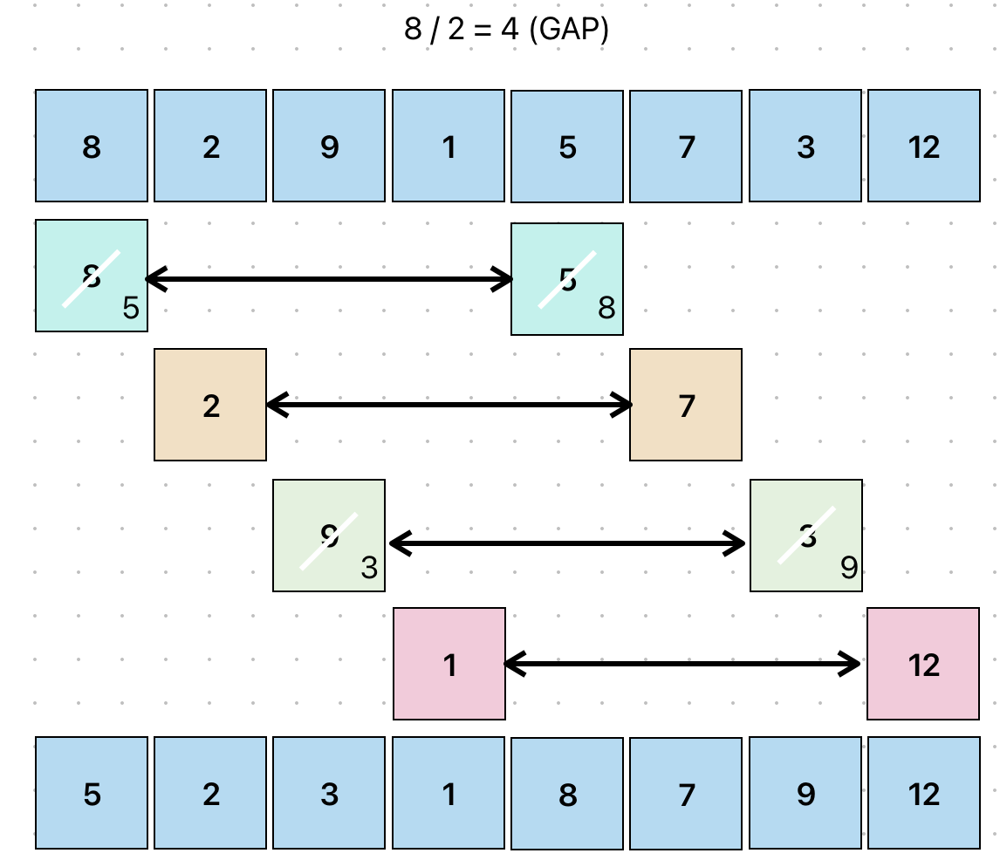
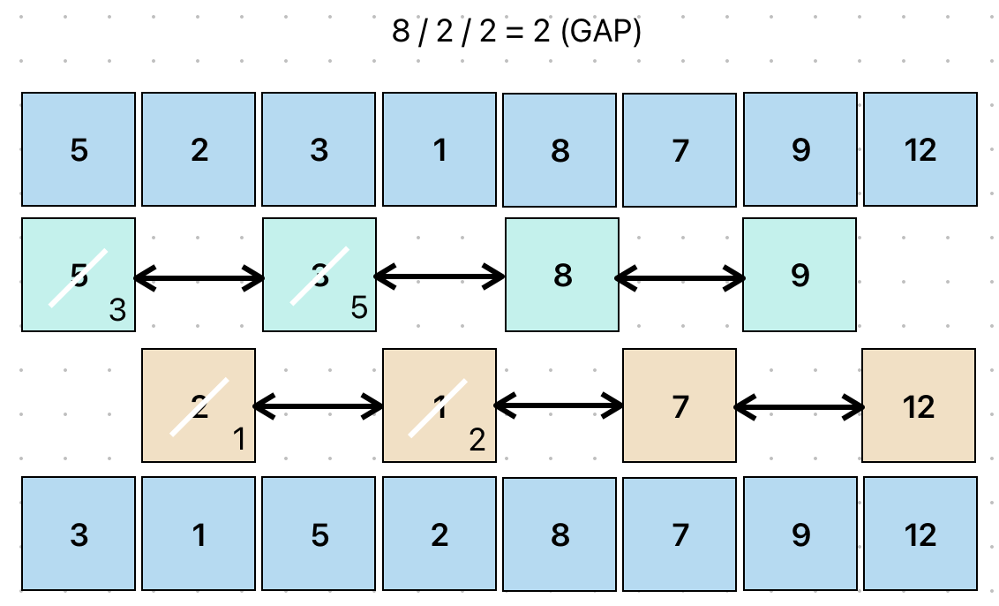
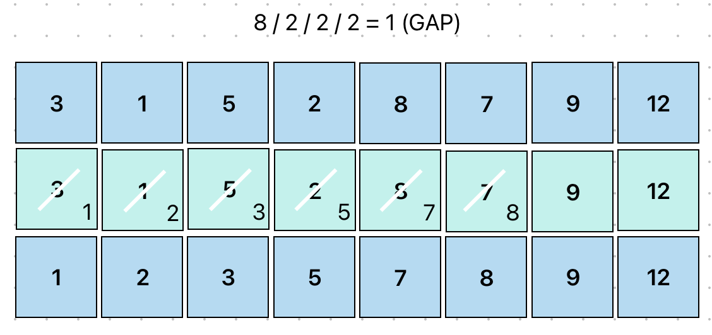

# Shell Sort 希爾排序
> 時間複雜度會因選用的GAP有所不同，但因為是插入排序改良版，幾乎所有狀況都能比O(n²)來得快。


希爾排序法 (Shell Sort) 是插入排序 (Insertion Sort) 的改良版。
通過先比較遠距離`(間隔 GAP)`的元素來移動數值，逐步縮小 GAP 直到等於 1，最後執行標準的插入排序。
GAP（間隔）通常取初始值為陣列長度的一半，然後逐步除以 2 直到 GAP 為 1。

- 將資料依制定的 GAP 分組。
- 由大到小制定數個 GAP ，最後一次的Gap一定要是1。
- GAP 決定了「相隔的距離」，不是單純地把陣列拆分為子序列。
- 在每一回合中，針對每個 GAP 的分組執行插入排序。

## 適用場景
- 幾乎排序好的陣列（Nearly Sorted Array）（比 Insertion Sort 快）。
- 中小型數據集（數百到數千筆資料）（比 Bubble / Insertion Sort 有效）。
- 內部排序（In-Place Sorting）（適用於記憶體受限環境，無需額外空間）。
- 不想使用遞迴的情況（不像 Quick Sort 需要遞迴）。
- 即時性要求高的應用（Shell Sort 時間複雜度不容易達到最壞 O(n²)）。

## 執行步驟
以下範例用 `[ 8, 2, 9, 1, 5, 7, 3, 12 ]` 做排序，長度 8
### 第一回合：8 / 2 = 4 GAP

比較相隔 4 的元素：
- 8 與 5 比較，8 > 5，交換位置 → [ 5, 2, 9, 1, 8, 7, 3, 12 ]。
- 2 與 7 比較，2 < 7，不用交換。
- 9 與 3 比較，9 > 3，交換位置 → [ 5, 2, 3, 1, 8, 7, 9, 12 ]。
- 1 與 12 比較，1 < 12，不用交換。
### 第二回合：4 / 2 = 2 GAP

比較相隔 2 的元素：
- 5 與 3 比較，5 > 3，交換位置 → [ 3, 2, 5, 1, 8, 7, 9, 12 ]。
- 2 與 1 比較，2 > 1，交換位置 → [ 3, 1, 5, 2, 8, 7, 9, 12 ]。
- 5 與 8 比較，5 < 8，不用交換。
- 2 與 7 比較，2 < 7，不用交換。
### 第三回合：2 / 2 = 1 GAP

比較相鄰元素：
- 3 與 1 比較，3 > 1，交換位置 → [ 1, 3, 5, 2, 8, 7, 9, 12 ]。
- 3 與 5 比較，3 < 5，不用交換。
- 5 與 2 比較，5 > 2，交換位置 → [ 1, 3, 2, 5, 8, 7, 9, 12 ]。
- 3 與 2 比較，3 > 2，交換位置 → [ 1, 2, 3, 5, 8, 7, 9, 12 ]。
- 5 與 8 比較，5 < 8，不用交換。
- 8 與 7 比較，8 > 7，交換位置 → [ 1, 2, 3, 5, 7, 8, 9, 12 ]。
- 8 與 9 比較，8 < 9，不用交換。

## 範例
```javascript showLineNumbers
function shellSort(arr) {
  const length = arr.length;
  let gap = Math.floor(length / 2);

  // 1. 逐漸縮小 GAP 值到 GAP 為 0
  while (gap > 0) {
    // 2. 針對每個 GAP 進行插入排序
    for (let i = gap; i < length; i++) {
      const temp = arr[i];
      let index = i;
      // 不能這樣寫，因為這會是舊值而不是新值
      // const left = arr[index - gap];
      // 3. 根據 GAP 比較並移動元素
      // index - gap = 左邊元素
      while (index >= gap && arr[index - gap] > temp) {
        // 將大的往後移
        arr[index] = arr[index - gap];
        // 繼續比較前面的
        index -= gap;
      }
      // 將 temp 插入到正確的位置
      arr[index] = temp;
    }
    // 縮小 GAP
    gap = Math.floor(gap / 2);
  }
  return arr;
}
console.log(shellSort([8, 2, 5, 7, 9, 1, 3, 12]));
```
## 拆解範例
### 1. 初始設定
```javascript showLineNumbers
const length = arr.length;
let gap = Math.floor(length / 2);
```
- 先記錄長度，初始的 GAP 為長度的一半。

### 2. 進行GAP 的縮小，直到 GAP 為 0
```javascript showLineNumbers
while(gap > 0) { 
    // ...
}
```

### 3. 進行插入排序
```javascript showLineNumbers
for (let i = gap; i < length; i++) {
  const temp = arr[i];
  let index = i;

  while (index >= gap && arr[index - gap] > temp) {
    arr[index] = arr[index - gap];
    index -= gap;
  }

  arr[index] = temp;
}
```
- 外層 `for` 迴圈：
    - 遍歷陣列所有元素，索引從 GAP 開始
- `while` 迴圈：
    - 負責進行插入排序
    - 比較 `arr[index]` 和 `arr[index - gap]`，若 `arr[index - gap]` 比較大，就將 `arr[index - gap]` 往後移

### 4. 縮小 GAP
```javascript showLineNumbers
gap = Math.floor(gap / 2 );
```
- 當第三步驟結束後，再次將 GAP 減半
- 當最後 `gap = 1` 時，會執行一次完整的插入排序來確保陣列順序是由小至大。

### 關於為什麼不能用一個變數紀錄 `arr[index - gap]` ?
```javascript showLineNumbers
while (index >= gap && arr[index - gap] > temp) {
  arr[index] = arr[index - gap];
  index -= gap;
}
arr[index] = temp;
```
上面這段程式碼看起來 `arr[index - gap]` 是可以重複的，感覺可以這樣寫：
```javascript showLineNumbers
let left = arr[index - gap];
while (index >= gap && left > temp) {
  arr[index] = left;
  index -= gap;
}
arr[index] = temp;
```
結果！！！！是錯的！！！！
:::danger
原因：
- **`left` 是靜態的，它不會隨著 `index` 的變化而更新**。
- 這破壞了 Shell 排序的邏輯，導致排序結果不正確。
:::
#### 範例分析：
假設我們有以下陣列和設定：
- 陣列 `[8, 2, 5, 7, 9, 1, 3, 12]`
- `gap = 4` 

發現第一輪是由 `arr[4] = 9` 和 `arr[0] = 8` 進行比較，但結果`9 > 8`，不需要交換，所以我們直接用第二輪講解：

1. 初始值(第二輪)：
    - `temp = arr[5]`
    temp 是目前要處理的元素，也就是 `arr[5]`，值為 `1`。
    - `index = i`：
    第二輪索引是 `5`，也就是我們要嘗試把 `arr[5]` 插入到正確位置。
    - `index - gap`：
    第二輪比較的索引是 `5 - 4 = 1`。

2. 比較結果：
    - 比較： `arr[5] = 1` 和 `arr[1] = 2`
    - 結果： `arr[1] > arr[5]` 發現需要交換！因此我們將 `arr[1]` 移動到 `arr[5]`
    - 變成：`[8, 2, 5, 7, 9, 2, 3, 12]`
    - 最後我們更新 `index = 1`

3. 再次比較：
    - 接下來比較 `arr[index - gap]`，也就是 `arr[1 - 4 = -3]`。
    - 因為索引 `-3` 無效，迴圈停止。
4. 最後插入元素：
    - 將 `temp = 1` 插入到正確位置 `arr[1]`
    - 變成：`[8, 1, 5, 7, 9, 2, 3, 12]`

由上述可以見 `index = 1`，當我們要再次比較時，`arr[index - gap]` 應該是 `arr[-3]`，但 `left` 無法捕捉到這一變化。
**因為 `left` 是靜態的**，當 `index` 更新時，`left` 不會跟著變化，他還是保留了第一次計算的 `arr[index - gap]`。
但因為我們使用 shell sort 需要重新讀取 `arr[index - gap]`，所以我們要必須確保他是動態的而不是靜態的！

我們必須要動態讀取 `arr[index - gap]`，因此正確作法如下：
```javascript showLineNumbers
while (index >= gap && arr[index - gap] > temp) {
  arr[index] = arr[index - gap]; // 動態讀取最新的值
  index -= gap;
}
arr[index] = temp;
```

<!-- 問題原因：

left 是靜態變數，當 index 更新時，left 的值並不會改變。它仍然保留了第一次計算 arr[index - gap] 的結果。

Shell 排序需要每次動態地重新計算 arr[index - gap]，以正確比較新位置的數值。

例如，在第二輪比較中，當 index = 1 時，應該計算 arr[index - gap] = arr[1 - 4 = -3]，但 left 無法捕捉到這一變化。 -->


> 參考文件：
> [【Day24】[演算法]-希爾排序法Shell Sort](https://ithelp.ithome.com.tw/m/articles/10277847)
[Youtube - Shell Sort Algorithm Example](https://youtu.be/1yDcmjLTWOg?si=TRJojQZqzb-9MZvx)
